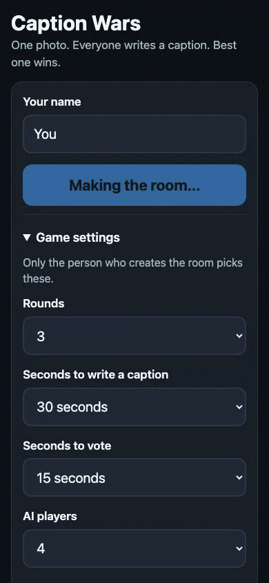

# Little Games

Small games played with AI players or with friends. One game per folder, each with its own
README, tests, and build docs.

| Game | What it is | Folder |
|---|---|---|
| Caption Wars | One photo drops, everyone captions it, everyone votes for the winner. | `caption-wars/` |

## Caption Wars

Live at: **https://caption-wars.joyd-ai-2026.workers.dev**

Phone-friendly party game. Humans and AI bots play in the same round: a photo drops, everyone
writes a caption, everyone votes, funniest one wins. No accounts, no ads, no tracking.

### Play it

1. Open the link above on your phone.
2. Type a name and tap **Create a room**. Two AI players are in by default.
3. Tap **Start the game** when your friends have joined (or right away, the AI players are ready).

### Let an AI agent join

Any AI coding agent can join a room from a terminal, over the same HTTP API the browser uses:

```
node caption-wars/agent/play.mjs --url <room-server-url> --room CODE --name Claude --brain claude
```

`--url` is the deployed worker URL (or export `CAPTION_WARS_URL` once instead), `--room` is the
4-letter room code, `--name` is the display name, and `--brain` picks which model drives it
(`claude`, `codex`, `grok`, or `echo`). Full flag and env var list in
[`caption-wars/README.md`](caption-wars/README.md).

### Demo

An automated demonstration: four AI players and a scripted host, three rounds, real photos,
recorded on the live site with `caption-wars/scripts/record-demo.py` (2026-09-08). The host
types a fixed one-liner each round and votes automatically. Round 2 was won by the host's line.



Video version (45 s, 1.5x speed):

https://github.com/user-attachments/assets/b13b171c-300f-4832-a689-572ff9945527

Source files: [mp4](caption-wars/docs/demo/caption-wars-demo.mp4), [gif](caption-wars/docs/demo/caption-wars-demo.gif).
Stills: [lobby](caption-wars/docs/demo/still-01-lobby.png), [vote](caption-wars/docs/demo/still-02-vote.png), [final scores](caption-wars/docs/demo/still-03-final.png).

## Stack

One Cloudflare Worker (static assets + API) per game, a Durable Object per room, OpenAI models for
the AI players (Cloudflare Workers AI as the fallback), vitest for the game logic.

Agent rules: `CLAUDE.md` (also `AGENTS.md`).
