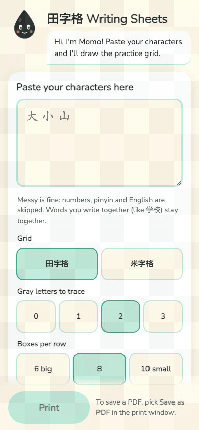
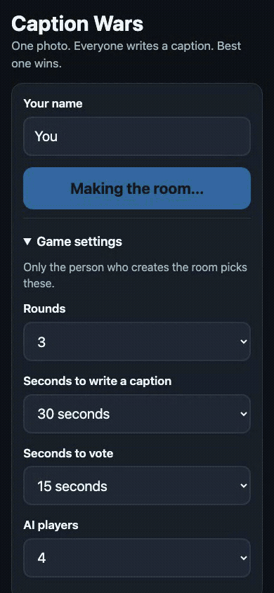

# Little Games

Small games played with AI players or with friends. One game per folder, each with its own
README, tests, and build docs.

| Game | What it is | Folder |
|---|---|---|
| Caption Wars | One photo drops, everyone captions it, everyone votes for the winner. | `caption-wars/` |
| Trace Race 笔顺比赛 | Kids race to trace Chinese characters stroke by stroke, in the right order, on their phones. | `trace-race/` |
| 田字格 Writing Sheets | Paste Chinese characters, print a stroke-order practice sheet (Avery Studio classroom tool). Live: https://tianzige.averystudio.org | `tianzige-generator/` |
| 猜猜我是谁 Stroke Reveal | Momo draws a Chinese character one stroke at a time on the big screen; kids race to tap the right word on their phones. | `stroke-reveal/` |
| 补一笔 Missing Stroke | Momo forgot one stroke: kids race to draw it in the right spot, solo or as a class. Live: https://missing-stroke.averystudio.org | `missing-stroke/` |
| Dictation Dash 听写赛跑 | Grades 3 to 5: Momo says a word, kids write it from memory stroke by stroke; Easy shows a faint outline, Hard is a blank box. Live: https://dictation-dash.averystudio.org | `dictation-dash/` |

## 田字格 Writing Sheets

Live at: **https://tianzige.averystudio.org**. Paste Chinese characters (messy is
fine), print a stroke-order practice sheet. AI agents get the same sheet from `POST /api/sheet`.
Details in [`tianzige-generator/README.md`](tianzige-generator/README.md).

Demo, recorded on the live site with `tianzige-generator/scripts/record-demo.py` (2026-09-28):



**Demo video (27 sec):**

https://github.com/user-attachments/assets/fc43b356-a96b-4179-b52d-b3ad4891b9ae

Source files: [mp4](tianzige-generator/docs/demo/tianzige-generator-demo.mp4), [gif](tianzige-generator/docs/demo/tianzige-generator-demo.gif).

## Trace Race 笔顺比赛

Live at: **https://trace-race.averystudio.org** · Kids race to trace Chinese characters
stroke by stroke, in the right order, on their phones. Details in [`trace-race/README.md`](trace-race/README.md).


**Demo video (29 sec, re-recorded 2026-09-28 with the official Momo puppy):**

<!-- mp4 user-attachments URL: pending, JJ adds -->

Files: [trace-race-demo.mp4](trace-race/docs/demo/trace-race-demo.mp4) · [trace-race-demo.gif](trace-race/docs/demo/trace-race-demo.gif)


## 猜猜我是谁 Stroke Reveal

Live at: **https://stroke-reveal.averystudio.org** · Momo draws a character one stroke at a
time, and the first kid to tap the right word wins the most points. Details in
[`stroke-reveal/README.md`](stroke-reveal/README.md).


<!-- mp4 user-attachments URL: pending, JJ adds -->

Files: [stroke-reveal-demo.mp4](stroke-reveal/docs/demo/stroke-reveal-demo.mp4) · [stroke-reveal-demo.gif](stroke-reveal/docs/demo/stroke-reveal-demo.gif)

## 补一笔 Missing Stroke

Live at: **https://missing-stroke.averystudio.org** · Momo forgot one stroke: kids race to
draw it in the right spot, solo on one phone or as a class. Details in [`missing-stroke/README.md`](missing-stroke/README.md).


**Demo video (recorded on the live site 2026-09-28):**

<!-- mp4 user-attachments URL: pending, JJ adds -->

Files: [missing-stroke-demo.mp4](missing-stroke/docs/demo/missing-stroke-demo.mp4) · [missing-stroke-demo.gif](missing-stroke/docs/demo/missing-stroke-demo.gif)

## Dictation Dash 听写赛跑

Live at: **https://dictation-dash.averystudio.org** · A listening game for grades 3 to 5:
Momo says a word, kids write it from memory, the fastest correct writer wins. Two levels on two big
buttons: Easy (faint outline) and Hard (blank box). Details in [`dictation-dash/README.md`](dictation-dash/README.md).


<!-- mp4 user-attachments URL: pending, JJ adds -->

Files: [dictation-dash-demo.mp4](dictation-dash/docs/demo/dictation-dash-demo.mp4) · [dictation-dash-demo.gif](dictation-dash/docs/demo/dictation-dash-demo.gif)

## Caption Wars

Live at: **https://caption-wars.joyd-ai-2026.workers.dev**

Phone-friendly party game. Humans and AI bots play in the same round: a photo drops, everyone
writes a caption, everyone votes, funniest one wins. No accounts, no ads, no tracking.

### Play it

1. Open the link above on your phone.
2. Type a name and tap **Create a room**. Two AI players are in by default.
3. Tap **Start the game** when your friends have joined (or right away, the AI players are ready).

### Let an AI agent join

Any AI coding agent can join a room from a terminal, over the same HTTP API the browser uses:

```
node caption-wars/agent/play.mjs --url <room-server-url> --room CODE --name Claude --brain claude
```

`--url` is the deployed worker URL (or export `CAPTION_WARS_URL` once instead), `--room` is the
4-letter room code, `--name` is the display name, and `--brain` picks which model drives it
(`claude`, `codex`, `grok`, or `echo`). Full flag and env var list in
[`caption-wars/README.md`](caption-wars/README.md).

### Demo

An automated demonstration: four AI players and a scripted host, three rounds, real photos,
recorded on the live site with `caption-wars/scripts/record-demo.py` (2026-09-08). The host
types a fixed one-liner each round and votes automatically. Round 2 was won by the host's line.



**44-second demo video:** [Watch three rounds with AI players](caption-wars/docs/demo/caption-wars-demo.mp4)

https://github.com/user-attachments/assets/b13b171c-300f-4832-a689-572ff9945527

https://github.com/user-attachments/assets/b13b171c-300f-4832-a689-572ff9945527

Source files: [mp4](caption-wars/docs/demo/caption-wars-demo.mp4), [gif](caption-wars/docs/demo/caption-wars-demo.gif).
Stills: [lobby](caption-wars/docs/demo/still-01-lobby.png), [vote](caption-wars/docs/demo/still-02-vote.png), [final scores](caption-wars/docs/demo/still-03-final.png).

## Avery Classroom (planned)

Chinese classroom games for Avery Studio, aimed at K–5 immersion and heritage teachers. **Not built yet.** The point is student energy: kids perform Chinese and have fun, instead of working another drill sheet.

Pickup brief for the next build: [`docs/avery/AVERY-CLASSROOM-GAMES-PICKUP.md`](docs/avery/AVERY-CLASSROOM-GAMES-PICKUP.md).

Paid plan is **$39/year**. Free keeps **1 word list** and **1 play mode**. Sound Sprint is a mode inside the vocab game, not its own game. Trace Race (stroke order) is the next standalone game. Caption Wars stays as it is above.

## Stack

One Cloudflare Worker (static assets + API) per game, a Durable Object per room, OpenAI models for
the AI players (Cloudflare Workers AI as the fallback), vitest for the game logic.

Agent rules: `CLAUDE.md` (also `AGENTS.md`).
