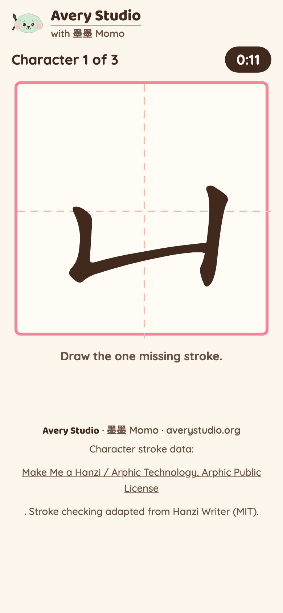
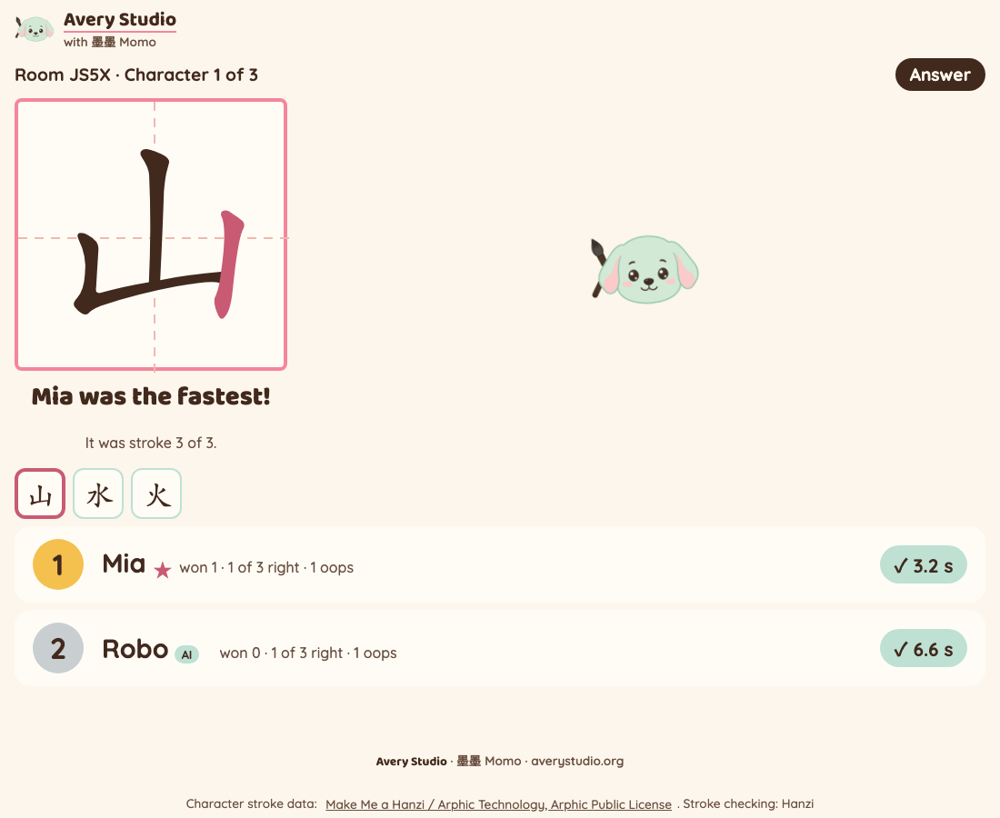
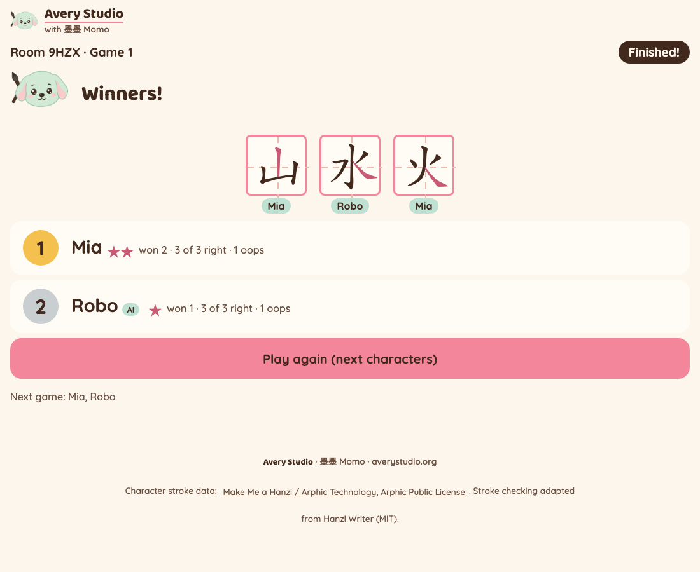

# Missing Stroke 补一笔

Live at: **https://missing-stroke.joyd-ai-2026.workers.dev**

An Avery Studio classroom game for Mandarin immersion K-5. Momo forgot one stroke, and kids race
to draw it in the right spot. Each character from the teacher's list shows up in ink with exactly
one stroke missing. The kid draws the missing stroke with a finger: right, and the stroke fills in
with ink and 墨墨 Momo cheers; wrong, and the pad wiggles (after a few wrong tries the missing
stroke flashes as a hint). The fastest right stroke wins the character. Then everyone sees the
answer in pink, and the next character opens.

Two ways to play:
- **By myself**: one phone, no code. Paste characters, tap **Play by myself**.
- **Class game**: the teacher makes a room, kids join with a 4-letter code, the teacher's screen is
  a live class board for the projector.

No accounts, no ads, no tracking, no sound. A display name lives only as long as the room (2 hours).

## Demo

Recorded on the live site by `scripts/live-run.py --record`: a real room, a browser kid (left,
phone) drawing each missing stroke with real pointer drags (the first one backwards on purpose,
so the pad wiggles), and an AI player racing through the API, with the class board on the right.
Silent, 1.25x speed.


<!-- mp4 user-attachments URL: pending, JJ adds -->

Files: [missing-stroke-demo.mp4](docs/demo/missing-stroke-demo.mp4) · [missing-stroke-demo.gif](docs/demo/missing-stroke-demo.gif)





Live evidence: [`docs/evidence/`](docs/evidence/) (API gate, class run, solo run).

## Play it

1. **Teacher**: open the link, paste your characters (numbers, pinyin, English and commas are fine,
   only the Chinese characters are kept), pick **who is playing** (K-1, Grades 2-3, Grades 4-5),
   tap **Make a class room**. Show the big code.
2. **Kids**: open the same link on a phone, type the code and a first name, tap **Join the game**.
3. **Teacher**: tap **Start the game**. 3-second countdown, then the first character opens for everyone.
4. A character closes when time runs out, when everyone has it, or a few seconds after the first
   right stroke. Everyone sees the answer, then the next one opens. Tap **Play again** for the next
   characters in your list.

Levels (`LEVELS` in `src/shared/config.ts`): K-1 = 30 seconds a character, hint after 1 wrong try;
Grades 2-3 = 20 s, hint after 2; Grades 4-5 = 12 s, hint after 3.

Scoring: most characters won (fastest right stroke; an exact same-millisecond tie shares it), then
most characters right, then fewer wrong tries, then less total time. Wrong tries and time only count
once a kid has got one right, so trying and missing never ranks a kid below someone who has not
started. Nothing is ever taken away.

Who plays: a kid who joins after Start watches that game and plays the next one. A kid whose phone
has not checked in for 45 seconds (`rosterActiveMs`) is left out of the next game. A kid who reopens
the teacher's link on the same phone goes straight back to their own seat.

Fair play: the room checks that an answer is for the character that is open now, and a pace floor
(no right stroke sooner than 700 ms after the character opens, `minAnswerMs`). Beyond that, answers
are honor-based: the phone reports right or wrong, and the "AI" tag is what the joiner says it is.

## Let an AI agent play

An agent plays through the same HTTP API the phones use. No npm install, Node 18+:

```
node missing-stroke/agent/play.mjs --url https://missing-stroke.joyd-ai-2026.workers.dev --room ABCD --name Robo
```

Flags: `--pace-ms 1500` (wait after a character opens, and after a miss, before answering),
`--mistakes 0.1` (chance of a miss, 0 to 0.9), `--seed 7` (repeatable misses).
`MISSING_STROKE_URL` can replace `--url`. The agent shows on the board with an "AI" tag.

### API

Every room route except create and join needs `x-player-id` and `x-player-secret` (you get them
from create or join). Errors are always JSON `{ "error": "..." }`.

| Route | Who | Body | Does |
|---|---|---|---|
| `POST /api/rooms` | teacher | `{ "text": "...paste...", "options"?: { "level"?: "little" \| "middle" \| "big", "charsPerRound"?: 5 } }` | makes a room |
| `POST /api/rooms/:code/join` | kid or agent | `{ "name": "Mia", "agent"?: true }` | joins |
| `GET /api/rooms/:code?v=N` | anyone in the room | | state, or `{ "unchanged": true }` if still version N |
| `POST /api/rooms/:code/stroke` | kid or agent | `{ "race": 1, "seq": 1, "turn": 0, "result": "correct" }` | one drawn stroke: right or wrong |
| `POST /api/rooms/:code/start` | teacher | | lobby to playing |
| `POST /api/rooms/:code/next` | teacher | | play again with the next characters |
| `POST /api/rooms/:code/list` | teacher | `{ "text": "..." }` | replace the list (not during a game) |
| `POST /api/rooms/:code/options` | teacher | `{ "level"?: "big", "charsPerRound"?: 5 }` | settings |
| `GET /api/strokes/:char` | anyone | | one character's stroke JSON (hash-checked proxy) |

The open character is `state.turn`: `char`, `hidden` (the missing stroke, a 0-based index into the
stroke JSON's `strokes` and `medians`), `opensAt`, `closesAt`, `closedAt` (null while open),
`winners`. `result` is `"correct"` or `"mistake"`; `turn` is `state.turn.index`; `race` is
`state.round` (an answer for another race or a closed character gets 409). `seq` is your own
counter for the race: 1, 2, 3... (start from `state.progress[you].seq + 1`); a `seq` already
applied is accepted and changes nothing, so retries are safe (a `seq` more than 1000 ahead gets
400). Answers before GO (`state.goAt`) get 409; a right answer faster than `state.rules.minAnswerMs`
after the character opens gets 429 (wait and resend). After a right answer, more answers for that
character get 409. `state.rules` carries every timing number (`secondsPerChar`, `hintAfterMisses`,
`revealMs`, `graceAfterFirstRightMs`, `minAnswerMs`), so an agent never hardcodes them.

```
U=https://missing-stroke.joyd-ai-2026.workers.dev
# teacher makes a room
curl -s -X POST $U/api/rooms -H 'content-type: application/json' \
  -d '{"text":"1. 山 shān\n2. 水 shuǐ\n3. 火 huǒ","options":{"level":"big"}}'
# -> { "code": "ABCD", "playerId": "...", "playerSecret": "...", "state": {...} }

# an agent joins
curl -s -X POST $U/api/rooms/ABCD/join -H 'content-type: application/json' -d '{"name":"Robo","agent":true}'

# teacher starts (teacher headers)
curl -s -X POST $U/api/rooms/ABCD/start -H "x-player-id: $TID" -H "x-player-secret: $TSECRET"

# after the character opens (state.turn.opensAt), the agent answers it
curl -s -X POST $U/api/rooms/ABCD/stroke -H 'content-type: application/json' \
  -H "x-player-id: $PID" -H "x-player-secret: $PSECRET" \
  -d '{"race":1,"seq":1,"turn":0,"result":"correct"}'
```

## How the missing stroke works

All drawing goes through one adapter, `src/client/tracer.ts`, so the library can be swapped.
Hanzi Writer's quiz can start at any stroke (`quizStartStrokeNum: k`): strokes before k show as
done and the next drawn stroke is checked against stroke k only. The pad stops the quiz right after
that one right stroke, so only the missing stroke is ever checked. The quiz hides the strokes AFTER
k and has no option to show them, so the adapter draws those itself, from the same stroke JSON,
lined up with the library's own `HanziWriter.getScalingTransform`. The outline stays off (it would
give the answer away). Which stroke is missing is a pure function of the race's random seed and the
character's place (`hiddenStrokeFor` in `src/shared/race.ts`), stored in the room so every phone agrees.

| Piece | Source | Pin | Licence |
|---|---|---|---|
| Stroke checking | Hanzi Writer, loaded from jsDelivr | `https://cdn.jsdelivr.net/npm/hanzi-writer@3.7.3/dist/hanzi-writer.min.js`, `integrity="sha384-xd6VpwMU5AxPFzG/nyhXrW70SSR2usiUNV8RrA0wlOjYlCrZyzZC6JiR/mT51pm2"`, `crossorigin="anonymous"` | MIT |
| Character stroke data | hanzi-writer-data 2.0.1 (9,574 characters), fetched ONLY by the Worker | `https://cdn.jsdelivr.net/npm/hanzi-writer-data@2.0.1/<char>.json` | Arphic Public License ([our copy](public/licenses/ARPHICPL.TXT), served at `/licenses/ARPHICPL.TXT`) |

Character stroke data: Make Me a Hanzi / Arphic Technology, Arphic Public License.

Security: the same mitigations as Trace Race (its two-round scan, 2026-09-28), copied unchanged:
- exact version pins, never a range; Subresource Integrity on the script;
- the library's built-in data loader is replaced, so kids' browsers never call the data CDN;
- `/api/strokes/:char` is not an open proxy: exactly one code point that is in the committed
  sha256 manifest (`src/worker/strokes-manifest.json`), else 400; upstream is hardcoded; the body
  is size-capped (`STROKE_MAX_BYTES`, 64 KB), hashed and compared to the manifest, and its JSON
  shape checked before it is returned, with `nosniff` and long cache headers.
- The room never calls the CDN: stroke counts are bundled (`src/worker/stroke-counts.json`).
- Solo mode looks characters up through the same proxy.

Characters with no stroke data are skipped with a note on the teacher screen.

Room creation is rate-limited per IP (`ROOM_CREATE_LIMITER`, 20 per minute, `wrangler.jsonc`). Each
game has its own rate-limit bucket, so the `namespace_id` must be unique across the repo:

| Game | namespace_id |
|---|---|
| Caption Wars | 1001 |
| Trace Race | 1002 |
| Dictation Dash | 1011, 1012 |
| Stroke Reveal | 1041 |
| Missing Stroke | 1051 |
| Tianzige Generator | 2001 |

## 墨墨 Momo

Official Momo from `avery-brand/` (the brand guide is the law): `public/momo.png` in the game
(lobby, cheer, reveal, winners), `public/momo-icon.png` in the header lockup and favicon, animated
with CSS only. Copied unedited; `npm run check:brand` compares them by sha256.

## Develop

```
npm install
npm test              # vitest (reducer, parser, Durable Object, stroke proxy, agent flow, client helpers) + node agent tests
npm run typecheck
npm run check:xss     # no raw HTML from user text in src/client
npm run check:palette # colours only from public/theme.css (Avery kit) and src/client/game.css
npm run check:brand   # theme.css + Momo PNGs identical to avery-brand/, title/favicon/header/footer present
npm run deploy        # build + wrangler deploy (workers.dev only)
node scripts/live-gate.mjs            # live API gate, prints a JSON receipt
python3 scripts/live-run.py           # live headless class run (--record: demo mp4 + gif, --solo: solo mode)
```

Stack: one Cloudflare Worker (static assets + API), one Durable Object per room, polling. Solo mode
runs the same reducer in the browser. Plan: `docs/plans/2026-09-28-missing-stroke-plan.md`. Build
report: `docs/2026-09-28-build-report.md`.

## Deferred

- Saved teacher lists (the later free and paid plans). No paywall, no accounts now.
- Answer timing uses the moment the room receives the answer (a slow phone is a little slower).
- Teacher "remove player" button.
