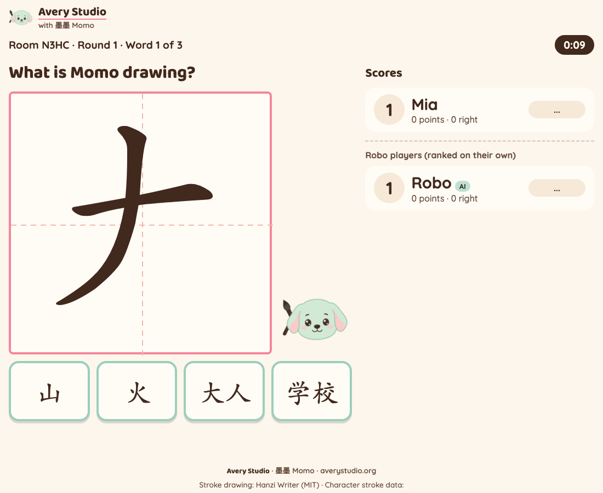
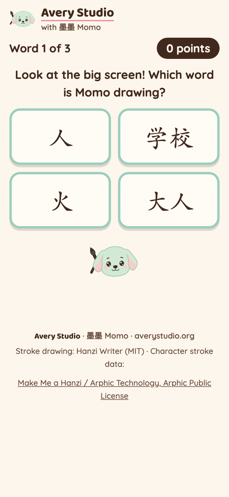
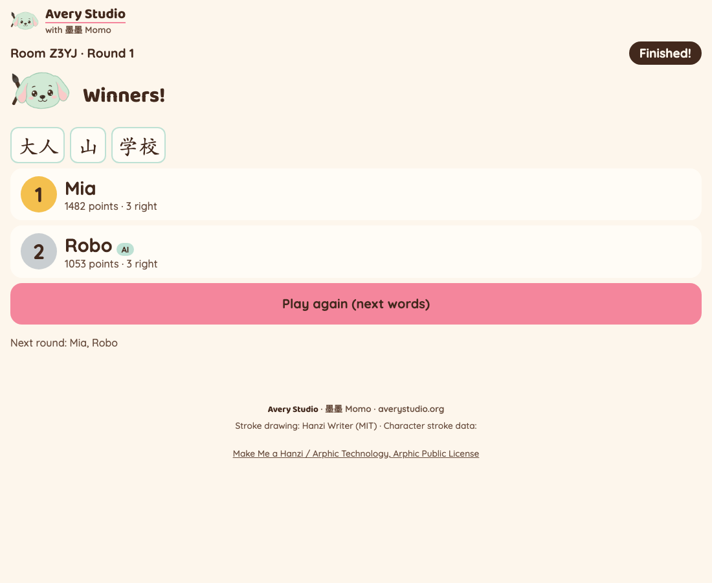

# 猜猜我是谁 Stroke Reveal

Live at: **https://stroke-reveal.averystudio.org**

The old address https://stroke-reveal.joyd-ai-2026.workers.dev still works and serves the same game.

An Avery Studio classroom reading game for Mandarin immersion K-5. Momo draws a character one
stroke at a time on the big screen, and the first kid to tap the right word wins. The teacher
pastes their own word list; each kid's phone shows four word cards from that list. A right tap
early in the drawing scores more than a right tap at the end. 墨墨 (Momo, the Avery Studio
puppy) tilts his head while he draws and bounces when the answer shows.

No accounts, no ads, no tracking, no sound. A display name lives only as long as the room (2 hours).

## Demo

Recorded on the live site by `scripts/record-demo.py`: a real room, a browser kid (left, phone)
tapping word cards with real clicks, an AI agent playing through the API, and the teacher's big
screen on the right. On word 2 the kid taps a wrong card first (the K-2 "try again" pause).
Silent, 1.25x speed. The browser kid is a scripted reader, not a person: it never looks at the
teacher's page; from its own seat it reads `/drawing` and the public stroke data of its own four
cards and taps the match once 2 strokes are up.


<!-- mp4 user-attachments URL: pending, JJ adds -->

Files: [stroke-reveal-demo.mp4](docs/demo/stroke-reveal-demo.mp4) · [stroke-reveal-demo.gif](docs/demo/stroke-reveal-demo.gif)





Live evidence: [`docs/evidence/2026-09-28-live-gate.json`](docs/evidence/2026-09-28-live-gate.json) (API gate, 23 of 23)
and [`docs/evidence/2026-09-28-live-run-record.json`](docs/evidence/2026-09-28-live-run-record.json) (the headless kid + teacher run that recorded the demo).

## Play it

1. **Teacher**: open the link on the classroom screen, paste your words (numbers, pinyin, English
   and headings like 第三课 are fine, we keep the Chinese words and tell you what we skipped), tap
   **Make a room**. Pick the class level and how many words per round. Show the big code.
2. **Kids**: open the same link on a phone, type the code and a first name, tap **Join the game**.
3. **Teacher**: tap **Start the game**. 3-second countdown, then Momo starts drawing.
4. Kids watch the big screen and tap the word on their phone. The answer shows, then the next word.
5. After the last word: Winners! Tap **Play again** for the next words in your list.

How words work: each card is one word from your list. Momo draws the FIRST character of the word
(学校 means Momo draws 学). The wrong cards never start with the same character, so there is
always exactly one right card. A list needs at least 4 words that start with different
characters (4 cards per word; fewer cards make blind tapping pay). A word whose first character
has no stroke data is left out, with a note on the teacher screen.

Surprise order: every word is picked independently from the whole list, so the words that
already played (which every phone sees in its history) never rule anything out; a word can come
back in a later question. The one exception is no immediate repeat: when the list has at least
5 words with different first characters, the previous word is skipped AND kept off the cards, so
its absence says nothing (on a shorter list, picks are fully independent). The wrong cards are
drawn from the whole list the same way. Every phone gets the four cards in its own order. The
pasted order, what played before, the card positions on the big screen and a neighbour's phone
say nothing about the answer (tests: about 1 in 4 over 500 rooms, and over every word of 3
rounds). Kids' phones never receive the list, the drawn character, its stroke count, the right
card, or any timing that reveals the stroke count or the answer while a word is open (the
teacher's big screen does). A phone still gets ordinary timing: `startAt`, `openAt`,
`strokeMs`, `closedAt` and the server clock.

Minimum reveal (`GAME.firstStrokeShowMs` 800 ms + `GAME.minRevealDelayMs` 600 ms): taps are
refused until stroke 1 is fully on the screen plus 600 ms. Scoring starts at that moment: 1000
points, falling in a straight line to 100 once the drawing is complete (`SCORING`). Most points
wins; equal points and equal right answers share a place. Nothing is ever taken away.

Levels (`LEVELS` in `src/shared/config.ts`):

| Level | Momo draws a stroke every | A wrong tap |
|---|---|---|
| K-2 | 1.5 s | nothing is taken away; cards go grey for 2 s (the same for every character, so it never tells the stroke count), then try again (the tried card is marked); a right tap after a miss earns half, after two misses a quarter |
| Grades 3-5 | 0.9 s | you sit out that word |

Blind tapping never beats reading: `tests/reveal.test.ts` taps cards at random as fast as the
rules allow and checks it scores below a kid who reads at mid-drawing, for 1 to 20 strokes at
both levels, and that tapping "cards that have not played yet" first scores about 317 points a
word against 550 for a mid-drawing reader. A flat 2 s pause alone failed that test on characters
of 5 or more strokes; a pause that grows with the drawing told kids the stroke count; so the
pause stays 2 s (3 tries fit in the 6 s after the drawing) and a right tap after a miss earns
`rightAfterMissFactor` (half) per miss.

AI players are ranked in their own "Robo players" line under the kids, never in a kid's place,
and they never hold a word open or close it early. Like the "AI" tag in Fair play below, this is
honor-based: a script that joins without `"agent": true` ranks among the kids.

A word closes when time runs out (6 s after the drawing is complete) or when every kid (not
counting AI players) has it right or is out. A kid who joins after Start watches and plays the next round. A kid whose phone
has not checked in for 45 seconds is left out of the next round.

Fair play: kids' phones never receive the drawn character or the right card while a word is open
(the teacher's big screen does). Beyond that, it is honor-based: the "AI" tag is what the joiner
says, so AI ranking apart depends on the joiner being honest (a script can read `/drawing` and
match stroke 1 exactly; kids would have to write code to do that).

## Let an AI agent play

An agent plays through the same HTTP API the phones use. It "looks at the big screen" with
`GET /api/rooms/:code/drawing` (the strokes Momo has drawn so far, nothing more) and compares them
with the public stroke data of each card's first character. No npm install, Node 18+:

```
node stroke-reveal/agent/play.mjs --url https://stroke-reveal.averystudio.org --room ABCD --name Robo
```

Flags: `--patience 0.4` (share of the character to see before guessing, 0 to 1), `--mistakes 0.1`
(chance of tapping a wrong card, 0 to 0.9), `--poll-ms 500`, `--seed 7` (repeatable mistakes).
`STROKE_REVEAL_URL` can replace `--url`. The agent shows on the board with an "AI" tag.

### API

Every room route except create and join needs `x-player-id` and `x-player-secret` (you get them
from create or join). Errors are always JSON `{ "error": "..." }`.

| Route | Who | Body | Does |
|---|---|---|---|
| `POST /api/rooms` | teacher | `{ "text": "...paste...", "options"?: { "level"?: "k2" \| "g35", "charsPerRound"?: 5 } }` | makes a room |
| `POST /api/rooms/:code/join` | kid or agent | `{ "name": "Mia", "agent"?: true }` | joins |
| `GET /api/rooms/:code?v=N` | anyone in the room | | state, or `{ "unchanged": true }` if still version N |
| `GET /api/rooms/:code/drawing` | anyone in the room | | `{ round, question, shown, complete, strokes: [svg path...], medians: [...] }`: only the strokes on the big screen |
| `POST /api/rooms/:code/guess` | kid or agent | `{ "race": 1, "question": 0, "seq": 1, "card": 2 }` | one tap on a card |
| `POST /api/rooms/:code/start` | teacher | | lobby to playing |
| `POST /api/rooms/:code/next` | teacher | | play again with the next words |
| `POST /api/rooms/:code/list` | teacher | `{ "text": "..." }` | replace the list (not during a round) |
| `POST /api/rooms/:code/options` | teacher | `{ "level"?: "k2" \| "g35", "charsPerRound"?: 5 }` | settings |
| `GET /api/strokes/:char` | anyone | | one character's stroke JSON (hash-checked proxy) |

Guess fields: `race` is `state.round`, `question` is `state.question.index`, `card` is the index
in YOUR `state.question.cards` (every phone has its own order). Taps before
`state.question.openAt` get 409. `seq` is your own tap counter for the round: 1, 2, 3... (start from
`state.score.seq + 1`); a `seq` already applied is accepted and changes nothing, so retries are
safe. A guess for another round or a closed word gets 409; before the drawing starts, 409; during
the K-2 pause, 429 (wait and resend). Your own tries are in `state.mine`; the right card
(`state.question.answer`, an index into your own cards) and the drawn character
(`state.question.char`) arrive once the word closes. `state.list`, `state.expiresAt` and
`state.question.endsAt` are teacher only (null for players). Kids rank in `state.standings`,
AI players in `state.robots`.

```
U=https://stroke-reveal.averystudio.org
# teacher makes a room
curl -s -X POST $U/api/rooms -H 'content-type: application/json' \
  -d '{"text":"1. 大人 dàrén\n2. 山 shān\n3. 学校 xuéxiào\n4. 人 rén","options":{"level":"g35","charsPerRound":2}}'
# -> { "code": "ABCD", "playerId": "...", "playerSecret": "...", "state": {...} }

# an agent joins
curl -s -X POST $U/api/rooms/ABCD/join -H 'content-type: application/json' -d '{"name":"Robo","agent":true}'

# teacher starts (teacher headers)
curl -s -X POST $U/api/rooms/ABCD/start -H "x-player-id: $TID" -H "x-player-secret: $TSECRET"

# after the countdown, the agent looks at the big screen
curl -s $U/api/rooms/ABCD/drawing -H "x-player-id: $PID" -H "x-player-secret: $PSECRET"

# and taps card 2 of word 0 in round 1
curl -s -X POST $U/api/rooms/ABCD/guess -H 'content-type: application/json' \
  -H "x-player-id: $PID" -H "x-player-secret: $PSECRET" \
  -d '{"race":1,"question":0,"seq":1,"card":2}'
```

## Stroke data and the drawing library

All drawing goes through one adapter, `src/client/drawer.ts`, so the library can be swapped.
Everything here is copied from Trace Race with all of its mitigations.

| Piece | Source | Pin | Licence |
|---|---|---|---|
| Stroke animation | Hanzi Writer, loaded from jsDelivr | `https://cdn.jsdelivr.net/npm/hanzi-writer@3.7.3/dist/hanzi-writer.min.js`, `integrity="sha384-xd6VpwMU5AxPFzG/nyhXrW70SSR2usiUNV8RrA0wlOjYlCrZyzZC6JiR/mT51pm2"`, `crossorigin="anonymous"` | MIT |
| Character stroke data | hanzi-writer-data 2.0.1 (9,574 characters), fetched ONLY by the Worker | `https://cdn.jsdelivr.net/npm/hanzi-writer-data@2.0.1/<char>.json` | Arphic Public License ([our copy](public/licenses/ARPHICPL.TXT), served at `/licenses/ARPHICPL.TXT`) |

- exact version pins, never a range; Subresource Integrity on the script;
- the library's built-in data loader is replaced, so browsers never call the data CDN;
- `/api/strokes/:char` is not an open proxy: exactly one code point that is in the committed
  sha256 manifest (`src/worker/strokes-manifest.json`), else 400; upstream is hardcoded; the body
  is size-capped (`STROKE_MAX_BYTES`), hashed and compared to the manifest, and its JSON shape
  checked before it is returned, with `nosniff` and long cache headers;
- `/drawing` loads its paths through the same checked loader and never names the character;
- the room never calls the CDN: stroke counts are bundled (`src/worker/stroke-counts.json`).

## 墨墨 Momo

Official Momo from `avery-brand/` (the brand guide is the law): `public/momo.png` in the game
(lobby, big screen, cheer, winners), always square and uniformly scaled, animated with CSS only;
`public/momo-icon.png` in the header lockup and favicon. `npm run check:brand` compares them by sha256.

## Develop

```
npm install
npm test              # vitest (reducer, parser, cards, Durable Object, /drawing, stroke proxy, agent flow) + node agent tests
npm run typecheck
npm run check:xss     # no raw HTML from user text in src/client
npm run check:palette # colours only from public/theme.css (Avery kit) and src/client/game.css
npm run check:brand   # theme.css + Momo PNGs identical to avery-brand/, title/favicon/header/footer present
npm run deploy        # build + wrangler deploy (workers.dev + stroke-reveal.averystudio.org)
node scripts/live-gate.mjs        # live API gate, prints a JSON receipt
python3 scripts/record-demo.py    # live headless kid + teacher run, stills + demo mp4 + gif (--no-video for stills only)
```

Stack: one Cloudflare Worker (static assets + API), one Durable Object per room, polling.
Plan: `docs/plans/2026-09-28-stroke-reveal-plan.md`. Build report: `docs/2026-09-28-build-report.md`.

## Deferred

- Saved teacher lists and modes (the later free and paid plans). No paywall, no accounts now.
- Sound (Momo's voice, a chime on a right tap). The game is silent by design for now.
- Teacher "remove player" and "skip this word" buttons.
