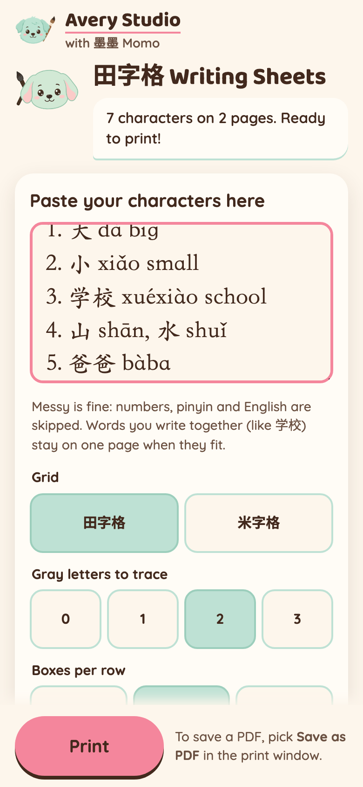
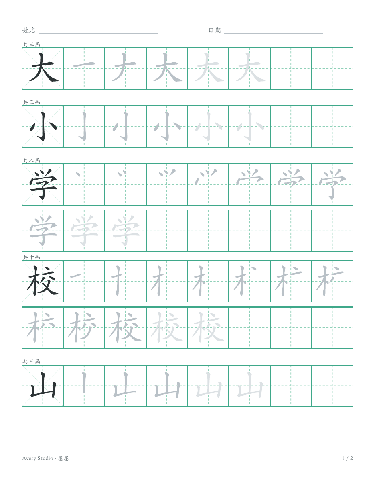

# 田字格 Writing Sheets

An Avery Studio classroom tool for Mandarin immersion K-5. A teacher pastes characters (messy is
fine), sees the practice sheet right away, and prints it.

**Live:** https://tianzige-generator.joyd-ai-2026.workers.dev




Stills: [phone](docs/demo/tianzige-phone.png), [phone preview](docs/demo/tianzige-phone-preview.png),
[print Letter 田字格](docs/demo/tianzige-print-letter.png), [print A4 米字格](docs/demo/tianzige-print-a4.png).
All captured on the live site by `scripts/capture-stills.py` (the print stills are Chromium's real
PDF output, rasterized).

## What one character row looks like

| Cell | What it shows |
|---|---|
| 1 | The finished character in solid ink, on a 米字格 (always, even on a 田字格 sheet) |
| 2 .. n+1 | The stroke build-up in gray: one more stroke per cell, once |
| next 0-3 | The whole character in light gray, to trace over (teacher picks how many) |
| the rest | Empty cells to write it alone, wrapping to more rows when needed |

Two-character words (学校) stay together. Leftover space on each page becomes extra practice rows,
so no page has a dead lower half. No English on the student page: only 姓名, 日期, and the
brand line at the foot.

## Messy paste rules

Anything that is not a Chinese character is a separator: numbering, punctuation, pinyin (with or
without tone marks), English glosses, emoji. A run of up to 4 characters written together stays
one word; a longer run (一二三四五六七) is treated as single characters. Repeats are dropped (first
one wins). Simplified and traditional both work and are never converted. Up to 40 characters per
sheet.

## For AI agents (same output over HTTP)

```bash
curl -s -X POST https://tianzige-generator.joyd-ai-2026.workers.dev/api/sheet \
  -H 'Content-Type: application/json' \
  -d '{"chars": "1. 大 dà big\n2. 学校 xuéxiào", "options": {"grid": "tian", "trace": 2, "perRow": 8, "paper": "letter"}}' \
  -o sheet.html
```

Returns one standalone printable HTML page (inline SVG, inline CSS, no scripts). Open it and print,
or print it headlessly. Response headers: `X-Sheet-Pages`, `X-Sheet-Chars`, `X-Sheet-Missing`
(characters drawn without stroke order), `X-Sheet-Truncated`; the character lists are
percent-encoded UTF-8.

| Option | Values | Default |
|---|---|---|
| `grid` | `tian` (田字格), `mi` (米字格) | `tian` |
| `trace` | 0, 1, 2, 3 | 2 |
| `perRow` | 6, 8, 10 | 8 |
| `paper` | `letter`, `a4` | `letter` |

Anything else falls back to the default. `GET /api/strokes/<one character>` returns the verified
stroke JSON for one character (404 when there is none).

## Stroke data

From `hanzi-writer-data@2.0.1` (derived from Make Me a Hanzi), fetched per character by the Worker
from jsDelivr. The browser never calls the CDN. The Worker accepts only one character that is in the
pinned manifest (`src/worker/stroke-manifest.json`, 9,574 characters), checks the body size, its
sha256 against the manifest, and its JSON shape before using it.

Character stroke data: Make Me a Hanzi / Arphic Technology, Arphic Public License
([license text](public/licenses/ARPHICPL.TXT), also served at `/licenses/ARPHICPL.TXT`).

## Develop

```bash
npm ci
npm test            # vitest
npm run typecheck
npm run check:xss   # no raw-markup APIs in client or shared code
npm run dev         # vite, UI only
npm run cf:dev      # build + wrangler dev, UI and API
npm run deploy      # build + deploy to workers.dev
python3 scripts/capture-stills.py   # re-capture docs/demo stills from the live site
```

Where things live:

| Thing | File |
|---|---|
| Colors (only place) | `public/theme.css` |
| Printed sheet styles | `public/sheet.css` |
| Layout numbers, teacher options, limits | `src/shared/config.ts` |
| Paste parsing | `src/shared/parse.ts` |
| The locked grid rules | `src/shared/layout.ts` |
| Sheet to SVG (used by browser and API) | `src/shared/render.ts` |
| Momo (placeholder art) | `public/momo.svg` |
| Cache time, upstream size cap, rate limit | `wrangler.jsonc` |
