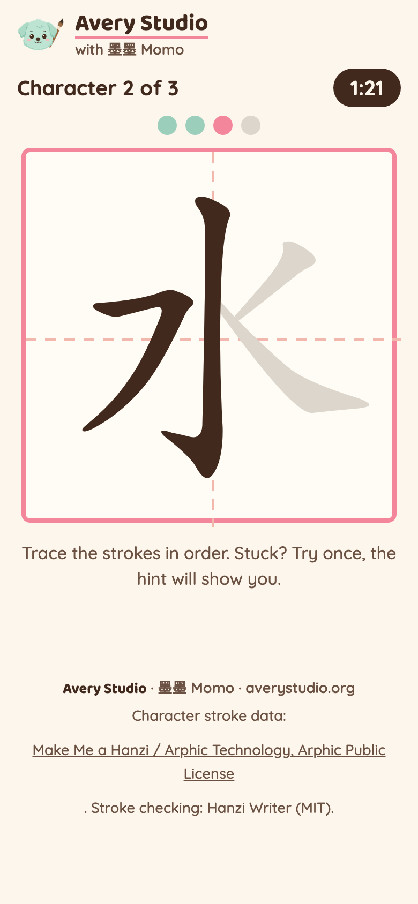
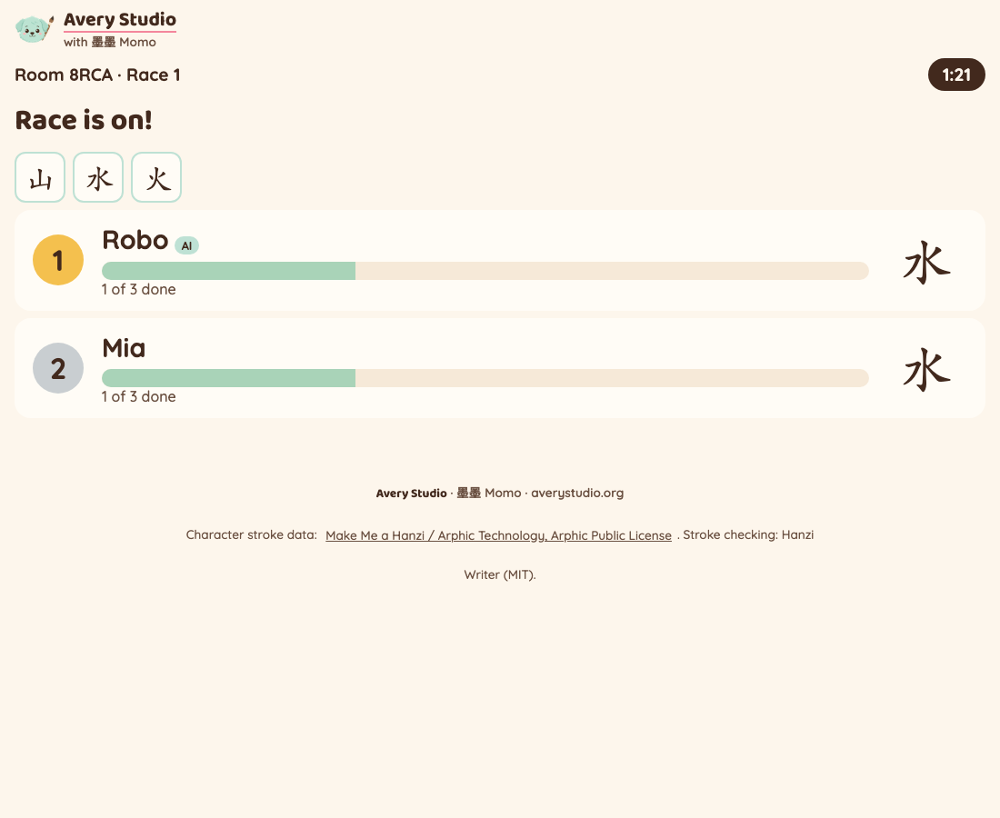
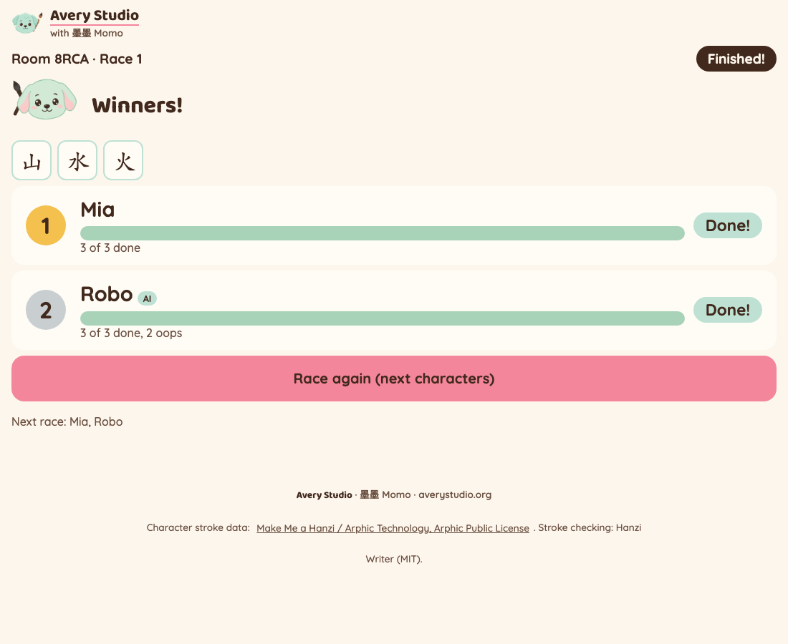

# Trace Race 笔顺比赛

Live at: **https://trace-race.joyd-ai-2026.workers.dev**

An Avery Studio classroom game for Mandarin immersion K-5. The teacher pastes a character list,
kids join on their phones, and everyone races to trace each character stroke by stroke, in the
right order. Correct strokes fill in with ink, a wrong stroke wiggles and shows the hint, and
墨墨 (Momo, the Avery Studio mint puppy) cheers every finished character. The teacher's screen is a live race
board for the classroom projector.

No accounts, no ads, no tracking, no sound. A display name lives only as long as the room (2 hours).

## Demo

Recorded on the live site by `scripts/live-run.py --record`: a real room, a browser kid (left,
phone) tracing 山 水 火 with real pointer drags, and an AI agent racing through the API, with the
teacher's race board on the right. Silent, 1.25x speed.


<!-- mp4 user-attachments URL: pending, JJ adds -->

Files: [trace-race-demo.mp4](docs/demo/trace-race-demo.mp4) · [trace-race-demo.gif](docs/demo/trace-race-demo.gif)





Live evidence: [`docs/evidence/2026-09-28-live-receipt.md`](docs/evidence/2026-09-28-live-receipt.md).

## Play it

1. **Teacher**: open the link, paste your characters (numbers, pinyin, English and commas are
   fine, only the Chinese characters are kept), tap **Make a room**. Show the big code.
2. **Kids**: open the same link on a phone, type the code and a first name, tap **Join the race**.
3. **Teacher**: tap **Start the race**. 3-second countdown, then everyone traces the same characters.
4. The race ends when time runs out or everyone finishes. Tap **Race again** for the next
   characters in your list.

Scoring: most characters finished wins, then most strokes into the current character, then
fewer mistakes, then who got there first. Mistakes only count once a kid has traced at least one
stroke, so trying and missing never ranks a kid below someone who has not started. Nothing is
ever taken away.

Who races: a kid who joins after Start watches that race and races the next one. A kid whose
phone has not checked in for 45 seconds (`rosterActiveMs`) is left out of the next race, so a kid
who went home is not stuck at 0 on the board. A kid who reopens the teacher's link on the same
phone goes straight back to their own seat.

Fair play: the room checks stroke ORDER and a pace floor (no faster than one correct stroke per
250 ms on average since GO, `minStrokeMs` in `src/shared/config.ts`). Beyond that, scoring is
honor-based: the phone reports each stroke, and the "AI" tag is what the joiner says it is.

Settings on the teacher screen: seconds per character, characters per race, stroke hints on/off
(on is best for K-2). Defaults and limits live in `src/shared/config.ts`.

## Let an AI agent race

An agent plays through the same HTTP API the phones use. No npm install, Node 18+:

```
node trace-race/agent/play.mjs --url https://trace-race.joyd-ai-2026.workers.dev --room ABCD --name Robo
```

Flags: `--pace-ms 700` (wait between strokes), `--mistakes 0.1` (chance of a miss, 0 to 0.9),
`--seed 7` (repeatable mistakes). `TRACE_RACE_URL` can replace `--url`. The agent shows on the
board with an "AI" tag.

### API

Every room route except create and join needs `x-player-id` and `x-player-secret` (you get them
from create or join). Errors are always JSON `{ "error": "..." }`.

| Route | Who | Body | Does |
|---|---|---|---|
| `POST /api/rooms` | teacher | `{ "text": "...paste...", "options"?: {...} }` | makes a room |
| `POST /api/rooms/:code/join` | kid or agent | `{ "name": "Mia", "agent"?: true }` | joins |
| `GET /api/rooms/:code?v=N` | anyone in the room | | state, or `{ "unchanged": true }` if still version N |
| `POST /api/rooms/:code/stroke` | kid or agent | `{ "race": 1, "seq": 1, "charIndex": 0, "strokeIndex": 0, "result": "correct" }` | one stroke result |
| `POST /api/rooms/:code/start` | teacher | | lobby to racing |
| `POST /api/rooms/:code/next` | teacher | | race again with the next characters |
| `POST /api/rooms/:code/list` | teacher | `{ "text": "..." }` | replace the list (not during a race) |
| `POST /api/rooms/:code/options` | teacher | `{ "secondsPerChar"?: 30, "charsPerRound"?: 5, "hints"?: true }` | settings |
| `GET /api/strokes/:char` | anyone | | one character's stroke JSON (hash-checked proxy) |

Strokes must go in order (`strokeIndex` is the next stroke of the character you are on,
`charIndex` is the character in `state.roundChars`). `result` is `"correct"` or `"mistake"`.
`race` is `state.round` (a stroke for another race gets 409). `seq` is your own stroke counter
for the race: 1, 2, 3... (start from `state.progress[you].seq + 1`); a `seq` already applied is
accepted and changes nothing, so retries are safe (a `seq` more than 1000 ahead gets 400). Strokes before GO (`state.goAt`) get 409, and
correct strokes faster than the pace floor get 429 (wait and resend). Stroke counts are in
`state.list.strokeCounts`.

```
U=https://trace-race.joyd-ai-2026.workers.dev
# teacher makes a room
curl -s -X POST $U/api/rooms -H 'content-type: application/json' \
  -d '{"text":"1. 山 shān\n2. 水 shuǐ\n3. 火 huǒ"}'
# -> { "code": "ABCD", "playerId": "...", "playerSecret": "...", "state": {...} }

# an agent joins
curl -s -X POST $U/api/rooms/ABCD/join -H 'content-type: application/json' -d '{"name":"Robo","agent":true}'

# teacher starts (teacher headers)
curl -s -X POST $U/api/rooms/ABCD/start -H "x-player-id: $TID" -H "x-player-secret: $TSECRET"

# after GO, the agent sends the first stroke of the first character
curl -s -X POST $U/api/rooms/ABCD/stroke -H 'content-type: application/json' \
  -H "x-player-id: $PID" -H "x-player-secret: $PSECRET" \
  -d '{"race":1,"seq":1,"charIndex":0,"strokeIndex":0,"result":"correct"}'
```

## Stroke data and the tracing library

All tracing goes through one adapter, `src/client/tracer.ts`, so the library can be swapped.

| Piece | Source | Pin | Licence |
|---|---|---|---|
| Tracing and stroke checking | Hanzi Writer, loaded from jsDelivr | `https://cdn.jsdelivr.net/npm/hanzi-writer@3.7.3/dist/hanzi-writer.min.js`, `integrity="sha384-xd6VpwMU5AxPFzG/nyhXrW70SSR2usiUNV8RrA0wlOjYlCrZyzZC6JiR/mT51pm2"`, `crossorigin="anonymous"` | MIT |
| Character stroke data | hanzi-writer-data 2.0.1 (9,574 characters), fetched ONLY by the Worker | `https://cdn.jsdelivr.net/npm/hanzi-writer-data@2.0.1/<char>.json` | Arphic Public License ([our copy](public/licenses/ARPHICPL.TXT), served at `/licenses/ARPHICPL.TXT`) |

Character stroke data: Make Me a Hanzi / Arphic Technology, Arphic Public License.

Security (two-round scan 2026-09-28, both WARN, all required mitigations applied):
- exact version pins, never a range; Subresource Integrity on the script;
- the library's built-in data loader is replaced, so kids' browsers never call the data CDN;
- `/api/strokes/:char` is not an open proxy: exactly one code point that is in the committed
  sha256 manifest (`src/worker/strokes-manifest.json`), else 400; upstream is hardcoded; the body
  is size-capped (`STROKE_MAX_BYTES`), hashed and compared to the manifest, and its JSON shape
  checked before it is returned, with `nosniff` and long cache headers.
- The room never calls the CDN: stroke counts are bundled (`src/worker/stroke-counts.json`,
  rebuilt with `node scripts/make-stroke-counts.mjs <unpacked hanzi-writer-data package>`, which
  refuses any file whose hash differs from the manifest).

Characters with no stroke data are skipped with a note on the teacher screen.

## 墨墨 Momo

Official Momo, locked 2026-09-24: the mint puppy with a calligraphy brush, from
`docs/avery/brand/` (the brand guide is the law). `public/momo.png` is the in-game Momo (lobby,
finish, winners, the full-screen 好棒! cheer), animated with CSS only (bounce, tilt, pop).
`public/momo-icon.png` is the header lockup icon and favicon. Both are copied unedited from
`avery-brand/`; `npm run check:brand` compares them by sha256.

## Develop

```
npm install
npm test              # vitest (reducer, parser, Durable Object, stroke proxy, agent flow) + node agent tests
npm run typecheck
npm run check:xss     # no raw HTML from user text in src/client
npm run check:palette # colours only from public/theme.css (Avery kit) and src/client/game.css (static files may repeat a token value)
npm run check:brand   # theme.css + Momo PNGs identical to avery-brand/, no retired colours or ink-drop file, title/favicon/header/footer present
npm run deploy        # build + wrangler deploy (workers.dev only)
node scripts/live-gate.mjs    # live API gate, prints a JSON receipt
python3 scripts/live-run.py   # live headless run (--blip: network cut, --record: demo mp4 + gif)
```

Stack: one Cloudflare Worker (static assets + API), one Durable Object per room, polling.
Plan: `docs/plans/2026-09-28-trace-race-plan.md`. Build report: `docs/2026-09-28-build-report.md`.

## Deferred

- Saved teacher lists and modes (the later free and paid plans). No paywall, no accounts now.
- Cheat resistance beyond the order check and the pace floor (honor-based by design for K-5).
- Teacher "remove player" button.
